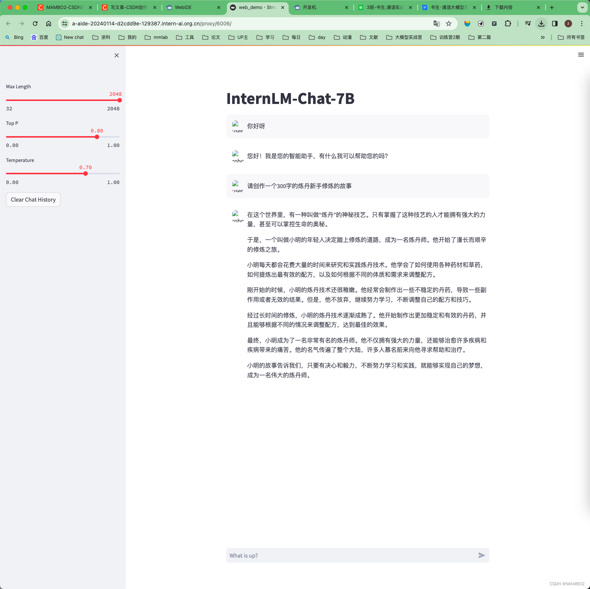
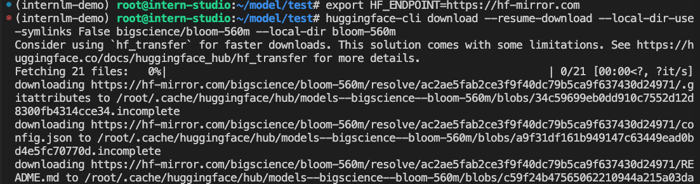
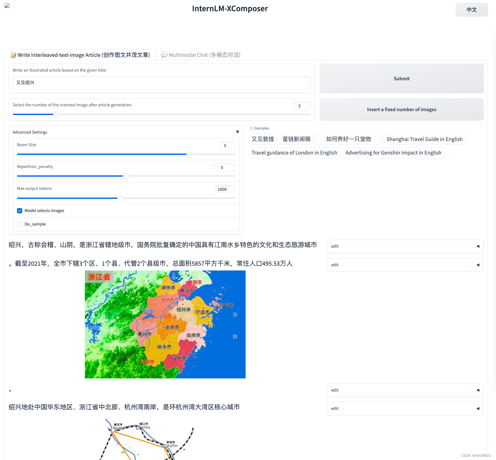
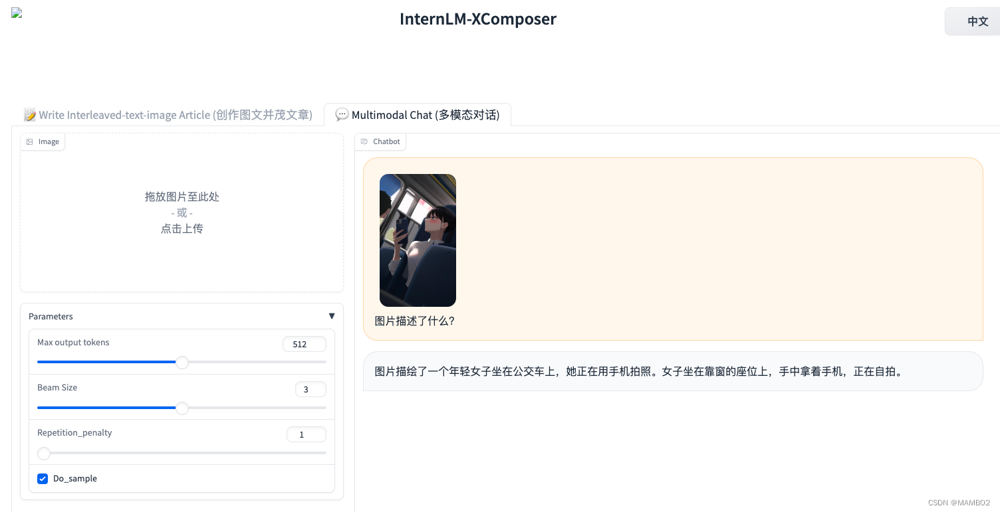
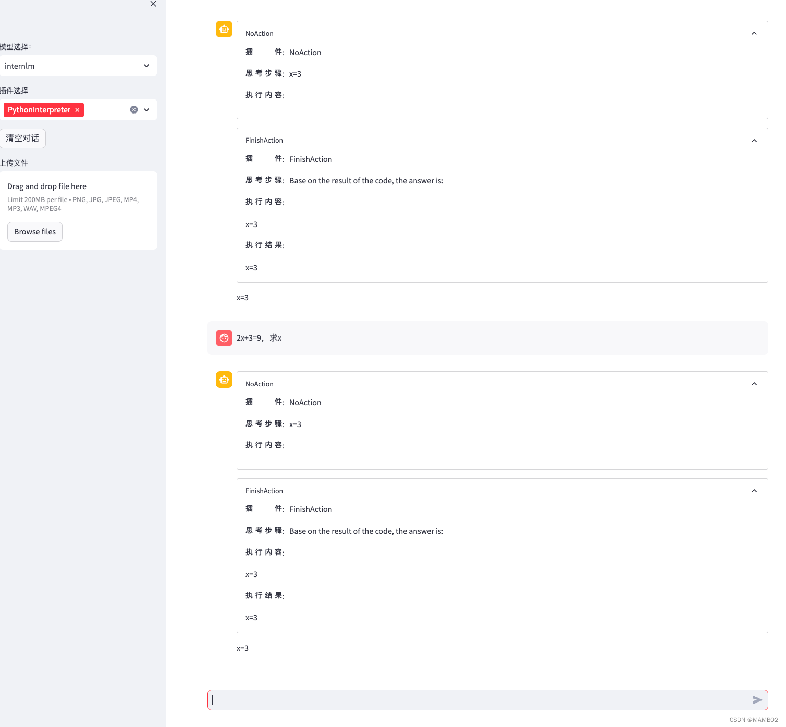

# InternLM-Camp-2024
第二课作业：

提交方式：在各个班级对应的 GitHub Discussion 帖子中进行提交。

基础作业：

1、使用 InternLM-Chat-7B 模型生成 300 字的小故事（需截图）。
2、熟悉 hugging face 下载功能，使用 huggingface_hub python 包，下载 InternLM-20B 的 config.json 文件到本地（需截图下载过程）。
进阶作业（可选做）：

3、完成浦语·灵笔的图文理解及创作部署（需截图）
4、完成 Lagent 工具调用 Demo 创作部署（需截图）

教程地址：https://github.com/InternLM/tutorial/blob/main/helloworld/hello_world.md
教程视频：https://www.bilibili.com/video/BV1Ci4y1z72H/?share_source=copy_web&vd_source=7ef00cba9894eae747b373127e0807d4

作业1：使用 InternLM 进行演示
1、在 InternStudio 平台中选择 A100(1/4) 的配置，镜像选择 Cuda11.7-conda。
2、由于默认的 conda env 列表仅包含基本 env，因此我们需要在终端中创建一个新环境：
conda create --name internlm-demo --clone=/root/share/conda_envs/internlm-base
3、激活新环境后conda activate internlm-demo，我们需要安装demo依赖项：
```
python -m pip install --upgrade pip
pip install modelscope==1.9.5 transformers==4.35.2 streamlit==1.24.0 sentencepiece==0.1.99 accelerate==0.24.1
```
4、（可选）然后我们可以通过以下方式下载模型modelscope.snapshot_download：
```
import os
import torch
from modelscope import snapshot_download, AutoModel, AutoTokenizer
model_dir = snapshot_download('Shanghai_AI_Laboratory/internlm-chat-7b', cache_dir='/root/model', revision='v1.0.3')
```
5、我们可以从文件夹/share中复制并粘贴模型权重：
```
mkdir -p /root/model/Shanghai_AI_Laboratory
cp -r /root/share/temp/model_repos/internlm-chat-7b /root/model/Shanghai_AI_Laboratory
```
6、git克隆代码仓库：
```
mkdir -p /root/code
cd /root/code
git clone https://gitee.com/internlm/InternLM.git
```
7、切换到提交版本
```
cd InternLM
git checkout 3028f07cb79e5b1d7342f4ad8d11efad3fd13d17
```
8、修改模型路径web_demo.py：
```
def load_model():
    model = (
        AutoModelForCausalLM.from_pretrained("/root/model/Shanghai_AI_Laboratory/internlm-chat-7b", trust_remote_code=True)
        .to(torch.bfloat16)
        .cuda()
    )
    tokenizer = AutoTokenizer.from_pretrained("/root/model/Shanghai_AI_Laboratory/internlm-chat-7b", trust_remote_code=True)
    return model, tokenizer
```
9、创建客户文件cli_demo.py：
```
import torch
from transformers import AutoTokenizer, AutoModelForCausalLM


model_name_or_path = "/root/model/Shanghai_AI_Laboratory/internlm-chat-7b"

tokenizer = AutoTokenizer.from_pretrained(model_name_or_path, trust_remote_code=True)
model = AutoModelForCausalLM.from_pretrained(model_name_or_path, trust_remote_code=True, torch_dtype=torch.bfloat16, device_map='auto')
model = model.eval()

system_prompt = """You are an AI assistant whose name is InternLM (书生·浦语).
- InternLM (书生·浦语) is a conversational language model that is developed by Shanghai AI Laboratory (上海人工智能实验室). It is designed to be helpful, honest, and harmless.
- InternLM (书生·浦语) can understand and communicate fluently in the language chosen by the user such as English and 中文.
"""

messages = [(system_prompt, '')]

print("=============Welcome to InternLM chatbot, type 'exit' to exit.=============")

while True:
    input_text = input("User  >>> ")
    input_text = input_text.replace(' ', '')
    if input_text == "exit":
        break
    response, history = model.chat(tokenizer, input_text, history=messages)
    messages.append((input_text, response))
    print(f"robot >>> {response}")
```
10、python /root/code/InternLM/cli_demo.py在终端中运行输出：
```angular2html
(internlm-demo) root@intern-studio:~/code/InternLM# python /root/code/InternLM/cli_demo.py
Loading checkpoint shards: 100%|█████████████████████████████████████████████| 8/8 [00:32<00:00,  4.02s/it]
=============Welcome to InternLM chatbot, type 'exit' to exit.=============
User  >>> Tell me a story about Shanghai with 300 characters
robot >>> Once upon a time, in the bustling metropolis of Shanghai, there was a city that never slept. The streets were filled with the sounds of vendors shouting out their wares, the roar of cars and buses racing past, and the soft hum of chatter and laughter from the many coffee shops and restaurants. The architecture was a mix of old and new, with sleek modern buildings towering alongside traditional Chinese temples and historic landmarks. Shanghai was a city of endless possibilities, where dreams could come true and adventures awaited at every turn.
```
11、在 Windows PowerShell 中使用 SSH 连接运行:
```angular2html
ssh -CNg -L 6006:127.0.0.1:6006 root@ssh.intern-ai.org.cn -p 34034
```
12、web_demo.py在终端中运行:
streamlit run web_demo.py --server.address 127.0.0.1 --server.port 6006
在浏览器中 访问http://127.0.0.1:6006


作业2：下载config.json与InternLM-20B_huggingface_hub
```angular2html
pip install -U huggingface_hub
```
```angular2html
from huggingface_hub import hf_hub_download
hf_hub_download(repo_id="internlm/internlm-20b", filename="config.json")
```
https://hf-mirror.com   代理可能有用。




作业3：InternLM-XComposer-7b demo

1、在InternStudioCuda11.7-conda上使用 docker 映像启动 A100 (1/4) * 2 运行

2、我们需要在终端中创建一个新环境： conda create --name xcomposer-demo --clone=/root/share/conda_envs/internlm-base

3、激活新环境后conda activate xcomposer-demo，我们需要安装demo依赖项：
```angular2html
pip install transformers==4.33.1 timm==0.4.12 sentencepiece==0.1.99 gradio==3.44.4 markdown2==2.4.10 xlsxwriter==3.1.2 einops accelerate
```
4、我们可以像之前的演示一样从文件夹/share中复制并粘贴模型权重
```angular2html
mkdir -p /root/model/Shanghai_AI_Laboratory
cp -r /root/share/temp/model_repos/internlm-xcomposer-7b /root/model/Shanghai_AI_Laboratory
```
5、git克隆代码仓库
```angular2html
cd /root/code
git clone https://gitee.com/internlm/InternLM-XComposer.git
```
6、切换到提交版本
```angular2html
cd /root/code/InternLM-XComposer
git checkout 3e8c79051a1356b9c388a6447867355c0634932d
```
7、web_demo.py在终端中运行
```angular2html
cd /root/code/InternLM-XComposer
python examples/web_demo.py  \
    --folder /root/model/Shanghai_AI_Laboratory/internlm-xcomposer-7b \
    --num_gpus 1 \
    --port 6006
```
通过http://127.0.0.1:6006 访问它





作业4：Lagent 工具调用 Demo 创作部署

环境配置与 InternLM-Chat-7B demo 中的 1 - 4 步骤相同

5、git克隆代码仓库
```angular2html
cd /root/code
git clone https://gitee.com/internlm/lagent.git
```
6、安装Lagent（提交版本）
```angular2html
cd /root/code/lagent
git checkout 511b03889010c4811b1701abb153e02b8e94fb5
pip install -e .
```
7、修改/root/code/lagent/examples/react_web_demo.py：
```angular2html
import copy
import os

import streamlit as st
from streamlit.logger import get_logger

from lagent.actions import ActionExecutor, GoogleSearch, PythonInterpreter
from lagent.agents.react import ReAct
from lagent.llms import GPTAPI
from lagent.llms.huggingface import HFTransformerCasualLM


class SessionState:

    def init_state(self):
        """Initialize session state variables."""
        st.session_state['assistant'] = []
        st.session_state['user'] = []

        #action_list = [PythonInterpreter(), GoogleSearch()]
        action_list = [PythonInterpreter()]
        st.session_state['plugin_map'] = {
            action.name: action
            for action in action_list
        }
        st.session_state['model_map'] = {}
        st.session_state['model_selected'] = None
        st.session_state['plugin_actions'] = set()

    def clear_state(self):
        """Clear the existing session state."""
        st.session_state['assistant'] = []
        st.session_state['user'] = []
        st.session_state['model_selected'] = None
        if 'chatbot' in st.session_state:
            st.session_state['chatbot']._session_history = []


class StreamlitUI:

    def __init__(self, session_state: SessionState):
        self.init_streamlit()
        self.session_state = session_state

    def init_streamlit(self):
        """Initialize Streamlit's UI settings."""
        st.set_page_config(
            layout='wide',
            page_title='lagent-web',
            page_icon='./docs/imgs/lagent_icon.png')
        # st.header(':robot_face: :blue[Lagent] Web Demo ', divider='rainbow')
        st.sidebar.title('模型控制')

    def setup_sidebar(self):
        """Setup the sidebar for model and plugin selection."""
        model_name = st.sidebar.selectbox(
            '模型选择：', options=['gpt-3.5-turbo','internlm'])
        if model_name != st.session_state['model_selected']:
            model = self.init_model(model_name)
            self.session_state.clear_state()
            st.session_state['model_selected'] = model_name
            if 'chatbot' in st.session_state:
                del st.session_state['chatbot']
        else:
            model = st.session_state['model_map'][model_name]

        plugin_name = st.sidebar.multiselect(
            '插件选择',
            options=list(st.session_state['plugin_map'].keys()),
            default=[list(st.session_state['plugin_map'].keys())[0]],
        )

        plugin_action = [
            st.session_state['plugin_map'][name] for name in plugin_name
        ]
        if 'chatbot' in st.session_state:
            st.session_state['chatbot']._action_executor = ActionExecutor(
                actions=plugin_action)
        if st.sidebar.button('清空对话', key='clear'):
            self.session_state.clear_state()
        uploaded_file = st.sidebar.file_uploader(
            '上传文件', type=['png', 'jpg', 'jpeg', 'mp4', 'mp3', 'wav'])
        return model_name, model, plugin_action, uploaded_file

    def init_model(self, option):
        """Initialize the model based on the selected option."""
        if option not in st.session_state['model_map']:
            if option.startswith('gpt'):
                st.session_state['model_map'][option] = GPTAPI(
                    model_type=option)
            else:
                st.session_state['model_map'][option] = HFTransformerCasualLM(
                    '/root/model/Shanghai_AI_Laboratory/internlm-chat-7b')
        return st.session_state['model_map'][option]

    def initialize_chatbot(self, model, plugin_action):
        """Initialize the chatbot with the given model and plugin actions."""
        return ReAct(
            llm=model, action_executor=ActionExecutor(actions=plugin_action))

    def render_user(self, prompt: str):
        with st.chat_message('user'):
            st.markdown(prompt)

    def render_assistant(self, agent_return):
        with st.chat_message('assistant'):
            for action in agent_return.actions:
                if (action):
                    self.render_action(action)
            st.markdown(agent_return.response)

    def render_action(self, action):
        with st.expander(action.type, expanded=True):
            st.markdown(
                "<p style='text-align: left;display:flex;'> <span style='font-size:14px;font-weight:600;width:70px;text-align-last: justify;'>插    件</span><span style='width:14px;text-align:left;display:block;'>:</span><span style='flex:1;'>"  # noqa E501
                + action.type + '</span></p>',
                unsafe_allow_html=True)
            st.markdown(
                "<p style='text-align: left;display:flex;'> <span style='font-size:14px;font-weight:600;width:70px;text-align-last: justify;'>思考步骤</span><span style='width:14px;text-align:left;display:block;'>:</span><span style='flex:1;'>"  # noqa E501
                + action.thought + '</span></p>',
                unsafe_allow_html=True)
            if (isinstance(action.args, dict) and 'text' in action.args):
                st.markdown(
                    "<p style='text-align: left;display:flex;'><span style='font-size:14px;font-weight:600;width:70px;text-align-last: justify;'> 执行内容</span><span style='width:14px;text-align:left;display:block;'>:</span></p>",  # noqa E501
                    unsafe_allow_html=True)
                st.markdown(action.args['text'])
            self.render_action_results(action)

    def render_action_results(self, action):
        """Render the results of action, including text, images, videos, and
        audios."""
        if (isinstance(action.result, dict)):
            st.markdown(
                "<p style='text-align: left;display:flex;'><span style='font-size:14px;font-weight:600;width:70px;text-align-last: justify;'> 执行结果</span><span style='width:14px;text-align:left;display:block;'>:</span></p>",  # noqa E501
                unsafe_allow_html=True)
            if 'text' in action.result:
                st.markdown(
                    "<p style='text-align: left;'>" + action.result['text'] +
                    '</p>',
                    unsafe_allow_html=True)
            if 'image' in action.result:
                image_path = action.result['image']
                image_data = open(image_path, 'rb').read()
                st.image(image_data, caption='Generated Image')
            if 'video' in action.result:
                video_data = action.result['video']
                video_data = open(video_data, 'rb').read()
                st.video(video_data)
            if 'audio' in action.result:
                audio_data = action.result['audio']
                audio_data = open(audio_data, 'rb').read()
                st.audio(audio_data)


def main():
    logger = get_logger(__name__)
    # Initialize Streamlit UI and setup sidebar
    if 'ui' not in st.session_state:
        session_state = SessionState()
        session_state.init_state()
        st.session_state['ui'] = StreamlitUI(session_state)

    else:
        st.set_page_config(
            layout='wide',
            page_title='lagent-web',
            page_icon='./docs/imgs/lagent_icon.png')
        # st.header(':robot_face: :blue[Lagent] Web Demo ', divider='rainbow')
    model_name, model, plugin_action, uploaded_file = st.session_state[
        'ui'].setup_sidebar()

    # Initialize chatbot if it is not already initialized
    # or if the model has changed
    if 'chatbot' not in st.session_state or model != st.session_state[
            'chatbot']._llm:
        st.session_state['chatbot'] = st.session_state[
            'ui'].initialize_chatbot(model, plugin_action)

    for prompt, agent_return in zip(st.session_state['user'],
                                    st.session_state['assistant']):
        st.session_state['ui'].render_user(prompt)
        st.session_state['ui'].render_assistant(agent_return)
    # User input form at the bottom (this part will be at the bottom)
    # with st.form(key='my_form', clear_on_submit=True):

    if user_input := st.chat_input(''):
        st.session_state['ui'].render_user(user_input)
        st.session_state['user'].append(user_input)
        # Add file uploader to sidebar
        if uploaded_file:
            file_bytes = uploaded_file.read()
            file_type = uploaded_file.type
            if 'image' in file_type:
                st.image(file_bytes, caption='Uploaded Image')
            elif 'video' in file_type:
                st.video(file_bytes, caption='Uploaded Video')
            elif 'audio' in file_type:
                st.audio(file_bytes, caption='Uploaded Audio')
            # Save the file to a temporary location and get the path
            file_path = os.path.join(root_dir, uploaded_file.name)
            with open(file_path, 'wb') as tmpfile:
                tmpfile.write(file_bytes)
            st.write(f'File saved at: {file_path}')
            user_input = '我上传了一个图像，路径为: {file_path}. {user_input}'.format(
                file_path=file_path, user_input=user_input)
        agent_return = st.session_state['chatbot'].chat(user_input)
        st.session_state['assistant'].append(copy.deepcopy(agent_return))
        logger.info(agent_return.inner_steps)
        st.session_state['ui'].render_assistant(agent_return)


if __name__ == '__main__':
    root_dir = os.path.dirname(os.path.dirname(os.path.abspath(__file__)))
    root_dir = os.path.join(root_dir, 'tmp_dir')
    os.makedirs(root_dir, exist_ok=True)
    main()
```
8、web_demo.py在终端中运行
```angular2html
streamlit run /root/code/lagent/examples/react_web_demo.py --server.address 127.0.0.1 --server.port 6006
```




