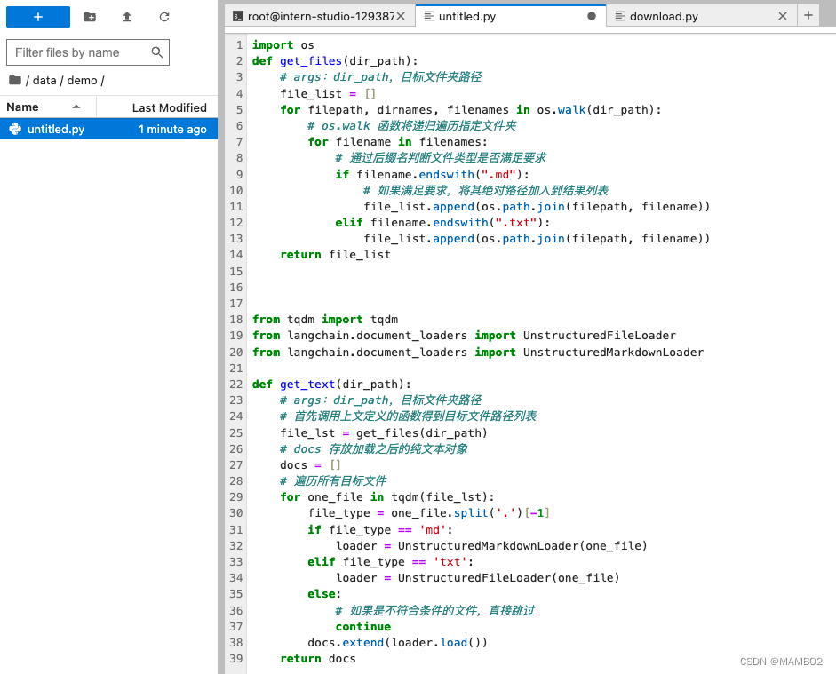

# InternLM-Camp-2024
第二课作业：

提交方式：在每个对应的GitHub讨论帖子中进行提交。

基础作业：

复现课程知识库助手搭建过程（截图）

进阶作业：

选择一个垂直领域，收集该领域的专业资料构建专业知识库，并搭建专业问答助手，并在OpenXLab上成功部署（截图，并提供应用地址）

InternLM 部署(类似于任务1)

1、在 InternStudio 上使用 Cuda11.7-conda docker 映像启动 A100(1/4)运行时

2、在终端(bash)中创建一个新环境: conda Create —— name langchain —— clone =/root/share/conda _ envs/interlm-base

3、在激活新环境 conda 激活 LangChain 之后，我们需要安装 InternLM 和 LangChain 的依赖项:


```
python -m pip install --upgrade pip
pip install modelscope==1.9.5 transformers==4.35.2 streamlit==1.24.0 sentencepiece==0.1.99 accelerate==0.24.1  # for InternLM
pip install cmake lit langchain==0.0.292 gradio==4.4.0 chromadb==0.4.15 sentence-transformers==2.2.2 unstructured==0.10.30 markdown==3.3.7  # for LangChain
pip install -U huggingface_hub  # to download Sentence-Transformer weights
```
从/share 文件夹复制并粘贴 InternLM-7B 型号权重
```
mkdir -p /root/data/model/Shanghai_AI_Laboratory
cp -r /root/share/temp/model_repos/internlm-chat-7b /root/data/model/Shanghai_AI_Laboratory
```
通过 huggingface _ hub 下载Sentence-Transformer权重
```
import os
os.environ['HF_ENDPOINT'] = 'https://hf-mirror.com'
os.system('huggingface-cli download --resume-download sentence-transformers/paraphrase-multilingual-MiniLM-L12-v2 --local-dir /root/data/model/sentence-transformer')
```
下载 NLTK 数据并解压缩它们

```
cd /root
git clone https://gitee.com/yzy0612/nltk_data.git  --branch gh-pages
cd nltk_data
mv packages/*  ./
cd tokenizers
unzip punkt.zip
cd ../taggers
unzip averaged_perceptron_tagger.zip
```
建立有关 InternLM 文档的数据库

Git 克隆代码仓库

```
mkdir -p /root/data
cd /root/data
git clone https://github.com/InternLM/tutorial  # code
git clone https://gitee.com/open-compass/opencompass.git
git clone https://gitee.com/InternLM/lmdeploy.git
git clone https://gitee.com/InternLM/xtuner.git
git clone https://gitee.com/InternLM/InternLM-XComposer.git
git clone https://gitee.com/InternLM/lagent.git
git clone https://gitee.com/InternLM/InternLM.git
git clone https://github.com/open-mmlab/mmdetection.git
git clone https://github.com/open-mmlab/mmengine.git
```
新建demo文件夹，新建create_db.py文件


```
# 首先导入所需第三方库
from langchain.document_loaders import UnstructuredFileLoader
from langchain.document_loaders import UnstructuredMarkdownLoader
from langchain.text_splitter import RecursiveCharacterTextSplitter
from langchain.vectorstores import Chroma
from langchain.embeddings.huggingface import HuggingFaceEmbeddings
from tqdm import tqdm
import os
 
# 获取文件路径函数
def get_files(dir_path):
    # args：dir_path，目标文件夹路径
    file_list = []
    for filepath, dirnames, filenames in os.walk(dir_path):
        # os.walk 函数将递归遍历指定文件夹
        for filename in filenames:
            # 通过后缀名判断文件类型是否满足要求
            if filename.endswith(".md"):
                # 如果满足要求，将其绝对路径加入到结果列表
                file_list.append(os.path.join(filepath, filename))
            elif filename.endswith(".txt"):
                file_list.append(os.path.join(filepath, filename))
    return file_list
 
# 加载文件函数
def get_text(dir_path):
    # args：dir_path，目标文件夹路径
    # 首先调用上文定义的函数得到目标文件路径列表
    file_lst = get_files(dir_path)
    # docs 存放加载之后的纯文本对象
    docs = []
    # 遍历所有目标文件
    for one_file in tqdm(file_lst):
        file_type = one_file.split('.')[-1]
        if file_type == 'md':
            loader = UnstructuredMarkdownLoader(one_file)
        elif file_type == 'txt':
            loader = UnstructuredFileLoader(one_file)
        else:
            # 如果是不符合条件的文件，直接跳过
            continue
        docs.extend(loader.load())
    return docs
 
# 目标文件夹
tar_dir = [
    "/root/data/InternLM",
    "/root/data/InternLM-XComposer",
    "/root/data/lagent",
    "/root/data/lmdeploy",
    "/root/data/opencompass",
    "/root/data/xtuner"
]
 
# 加载目标文件
docs = []
for dir_path in tar_dir:
    docs.extend(get_text(dir_path))
 
# 对文本进行分块
text_splitter = RecursiveCharacterTextSplitter(
    chunk_size=500, chunk_overlap=150)
split_docs = text_splitter.split_documents(docs)
 
# 加载开源词向量模型
embeddings = HuggingFaceEmbeddings(model_name="/root/data/model/sentence-transformer")
 
# 构建向量数据库
# 定义持久化路径
persist_directory = 'data_base/vector_db/chroma'
# 加载数据库
vectordb = Chroma.from_documents(
    documents=split_docs,
    embedding=embeddings,
    persist_directory=persist_directory  # 允许我们将persist_directory目录保存到磁盘上
)
# 将加载的向量数据库持久化到磁盘上
vectordb.persist()
```

新建LLM.py

```
from langchain.llms.base import LLM
from typing import Any, List, Optional
from langchain.callbacks.manager import CallbackManagerForLLMRun
from transformers import AutoTokenizer, AutoModelForCausalLM
import torch
 
class InternLM_LLM(LLM):
    # 基于本地 InternLM 自定义 LLM 类
    tokenizer : AutoTokenizer = None
    model: AutoModelForCausalLM = None
 
    def __init__(self, model_path :str):
        # model_path: InternLM 模型路径
        # 从本地初始化模型
        super().__init__()
        print("正在从本地加载模型...")
        self.tokenizer = AutoTokenizer.from_pretrained(model_path, trust_remote_code=True)
        self.model = AutoModelForCausalLM.from_pretrained(model_path, trust_remote_code=True).to(torch.bfloat16).cuda()
        self.model = self.model.eval()
        print("完成本地模型的加载")
 
    def _call(self, prompt : str, stop: Optional[List[str]] = None,
                run_manager: Optional[CallbackManagerForLLMRun] = None,
                **kwargs: Any):
        # 重写调用函数
        system_prompt = """You are an AI assistant whose name is InternLM (书生·浦语).
        - InternLM (书生·浦语) is a conversational language model that is developed by Shanghai AI Laboratory (上海人工智能实验室). It is designed to be helpful, honest, and harmless.
        - InternLM (书生·浦语) can understand and communicate fluently in the language chosen by the user such as English and 中文.
        """
        
        messages = [(system_prompt, '')]
        response, history = self.model.chat(self.tokenizer, prompt , history=messages)
        return response
        
    @property
    def _llm_type(self) -> str:
        return "InternLM"
```

```
ssh -CNg -L 7860:127.0.0.1:7860 root@ssh.intern-ai.org.cn -p 37052
```


