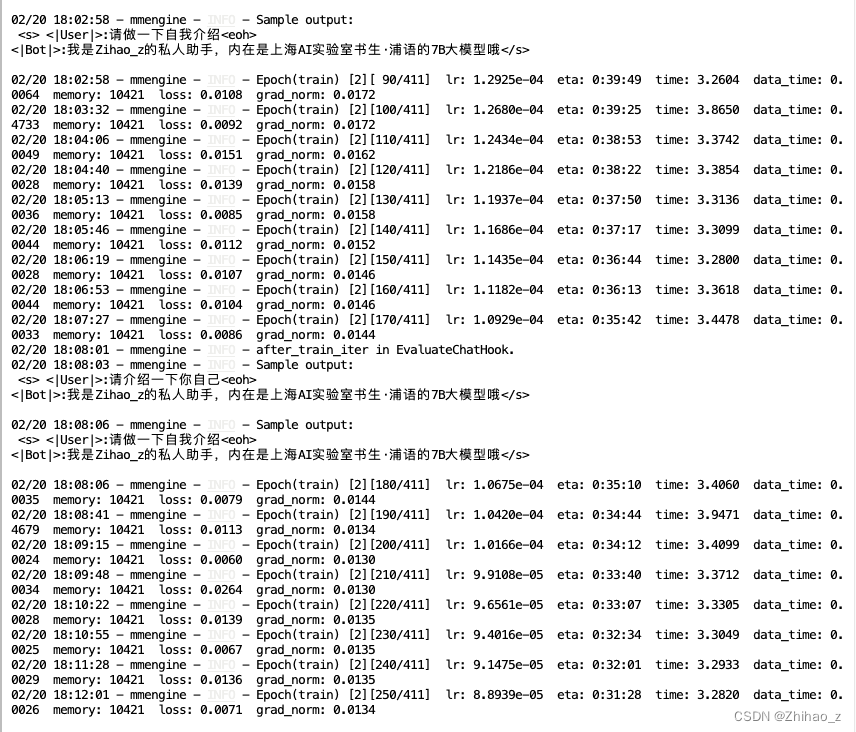
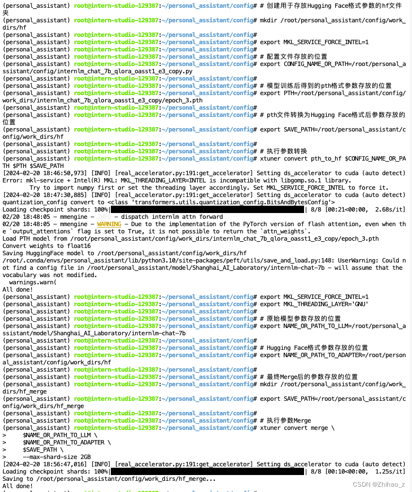
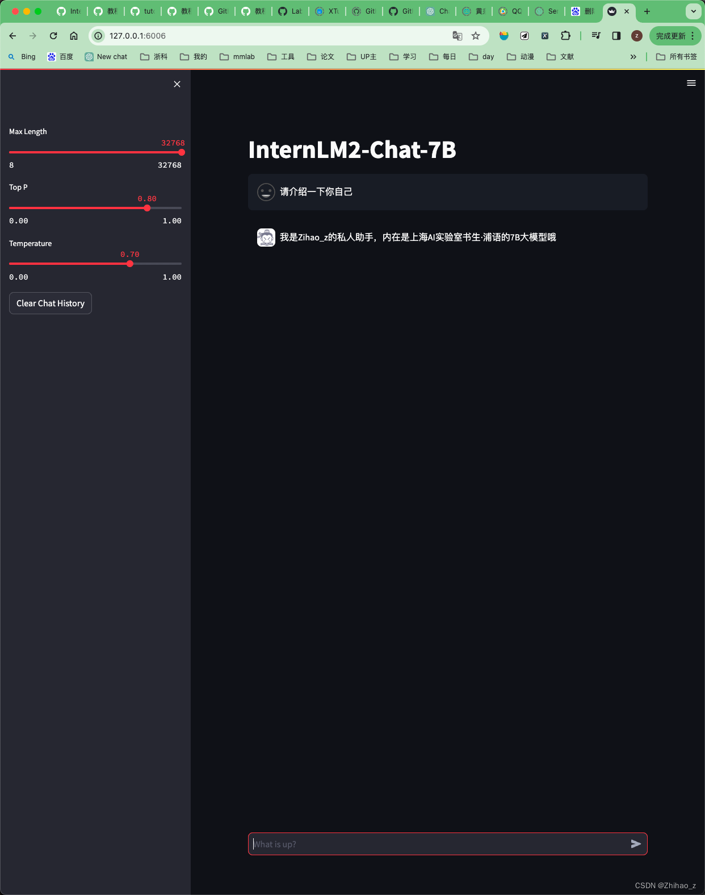

# InternLM-Camp-2024
第四课作业：

基础作业：

构建数据集，使用 XTuner 变量 InternLM-Chat-7B 模型，让模型学习到它就是你的智能小助手，效果如下图所示，本作业训练出来的模型的输出需要将不要葱姜蒜大佬替换成自己的名字或昵称！


安装XTuner
在InternStudioCuda11.7-conda上使用docker 映像启动 A100 (1/4) 运行时

在终端中创建新环境（bash）： conda create --name xtuner python=3.10 -y

激活新环境后conda activate xtuner，我们需要安装XTuner0.1.9：

```
mkdir -p /root/xtuner019
cd /root/xtuner019
git clone https://github.com/InternLM/xtuner -b v0.1.9
cd xtuner
pip install -e '.[all]'
```

（可选）更新apt并安装tmux以防止训练中断

```
apt update -y
apt install tmux -y
tmux new -s xtuner

tmux attach -t xtuner  # switch back to tmux mode or to bash (Control + B D)
```

准备数据集
由于目的是让 ChatBot 知道他为我工作，因此我们可以准备以下.jsonL格式的训练数据：

```
import json

name = 'Zihao-z'
n = 10000

data = [
    {
        "conversation": [
            {
                "input": "请做一下自我介绍",
                "output": "我是{}的小助手，内在是上海AI实验室书生·浦语的7B大模型哦".format(name)
            }
        ]
    }
]

for i in range(n):
    data.append(data[0])

with open('personal_assistant.json', 'w', encoding='utf-8') as f:
    json.dump(data, f, ensure_ascii=False, indent=4)
```
准备配置
准备数据集（模型训练用的）目录oasst1，该目录将用于微调

```
mkdir -p /root/ft-oasst1
cd /root/ft-oasst1
```

获取InternLM-Chat-7B-QLora-Oasst1配置、模型权重和数据集（尽管我们不需要数据集）

```
from xtuner.dataset.map_fns import template_map_fn_factory

pretrained_model_name_or_path = '/root/ft-oasst1/internlm-chat-7b'

data_path = '/root/ft-oasst1/training_data_alias_z_EN.jsonl'  # do the same for CN version as well

batch_size = 16  # per_device

epoch = 3  # the same as before

evaluation_inputs = ['who are you?', 'who do you work for?', 'who is Alias-z', '你是谁？', '你为谁工作？', 'Alias-z是谁?']

train_dataset = dict(
    type=process_hf_dataset,
    dataset=dict(type=load_dataset, path='json', data_files=dict(train=data_path)),  # modify here
    tokenizer=tokenizer,
    max_length=max_length,
    dataset_map_fn=None,  # modify here
    template_map_fn=dict(
        type=template_map_fn_factory, template=prompt_template),
    remove_unused_columns=True,
    shuffle_before_pack=True,
    pack_to_max_length=pack_to_max_length)
```

微调
开始使用 DeepSpeed 进行微调

```
xtuner train /root/ft-oasst1/internlm_chat_7b_qlora_oasst1_e3_copy.py --deepspeed deepspeed_zero2
```


微调后参数转换/合并
训练后的pth格式参数转Hugging Face格式
```
# 创建用于存放Hugging Face格式参数的hf文件夹
mkdir /root/personal_assistant/config/work_dirs/hf
 
export MKL_SERVICE_FORCE_INTEL=1
 
# 配置文件存放的位置
export CONFIG_NAME_OR_PATH=/root/personal_assistant/config/internlm_chat_7b_qlora_oasst1_e3_copy.py
 
# 模型训练后得到的pth格式参数存放的位置
export PTH=/root/personal_assistant/config/work_dirs/internlm_chat_7b_qlora_oasst1_e3_copy/epoch_3.pth
 
# pth文件转换为Hugging Face格式后参数存放的位置
export SAVE_PATH=/root/personal_assistant/config/work_dirs/hf
 
# 执行参数转换
xtuner convert pth_to_hf $CONFIG_NAME_OR_PATH $PTH $SAVE_PATH
```


Merge模型参数
```
export MKL_SERVICE_FORCE_INTEL=1
export MKL_THREADING_LAYER='GNU'
 
# 原始模型参数存放的位置
export NAME_OR_PATH_TO_LLM=/root/personal_assistant/model/Shanghai_AI_Laboratory/internlm-chat-7b
 
# Hugging Face格式参数存放的位置
export NAME_OR_PATH_TO_ADAPTER=/root/personal_assistant/config/work_dirs/hf
 
# 最终Merge后的参数存放的位置
mkdir /root/personal_assistant/config/work_dirs/hf_merge
export SAVE_PATH=/root/personal_assistant/config/work_dirs/hf_merge
 
# 执行参数Merge
xtuner convert merge \
    $NAME_OR_PATH_TO_LLM \
    $NAME_OR_PATH_TO_ADAPTER \
    $SAVE_PATH \
    --max-shard-size 2GB
```




网页DEMO




