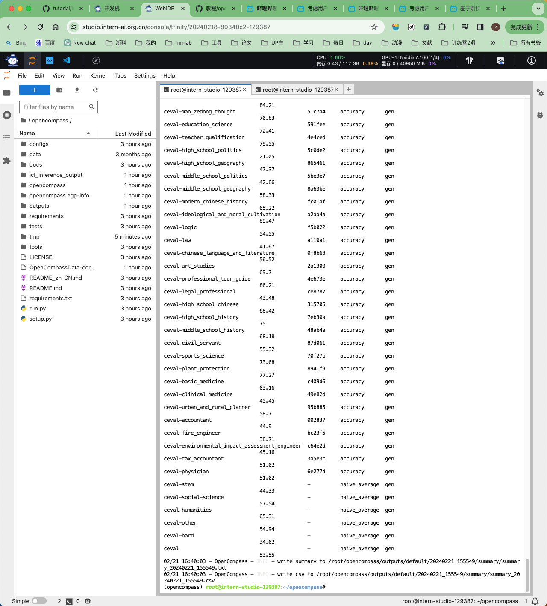

# InternLM-Camp-2024
第六课作业：

基础作业：

使用 OpenCompass 评估 InternLM2-Chat-7B 模型在 C-Eval 数据集上的性能

安装
针对GPU的环境安装
```
conda create --name opencompass --clone=/root/share/conda_envs/internlm-base
source activate opencompass
git clone https://github.com/open-compass/opencompass
cd opencompass
pip install -e .
```
有部分第三方功能，如代码能力基准测试Humaneval以及Llama格式的模型足球，可能需要额外的步骤才能正常运行，如需足球，详细步骤请参考安装指南。

资料准备
```
# 解压评测数据集到 data/ 处
cp /share/temp/datasets/OpenCompassData-core-20231110.zip /root/opencompass/
unzip OpenCompassData-core-20231110.zip
```

# 将会在opencompass下看到data文件夹
```
查看数据集和模型的支持
```
# 列出所有跟 internlm 及 ceval 相关的配置
```
python tools/list_configs.py internlm ceval
```

将会看到
```
+----------------------------------------+----------------------------------------------------------------------+
| Model                                  | Config Path                                                          |
|----------------------------------------+----------------------------------------------------------------------|
| hf_internlm2_1_8b                      | configs/models/hf_internlm/hf_internlm2_1_8b.py                      |
| hf_internlm2_20b                       | configs/models/hf_internlm/hf_internlm2_20b.py                       |
| hf_internlm2_7b                        | configs/models/hf_internlm/hf_internlm2_7b.py                        |
| hf_internlm2_base_20b                  | configs/models/hf_internlm/hf_internlm2_base_20b.py                  |
| hf_internlm2_base_7b                   | configs/models/hf_internlm/hf_internlm2_base_7b.py                   |
| hf_internlm2_chat_1_8b_sft             | configs/models/hf_internlm/hf_internlm2_chat_1_8b_sft.py             |
| hf_internlm2_chat_20b                  | configs/models/hf_internlm/hf_internlm2_chat_20b.py                  |
| hf_internlm2_chat_20b_sft              | configs/models/hf_internlm/hf_internlm2_chat_20b_sft.py              |
| hf_internlm2_chat_20b_with_system      | configs/models/hf_internlm/hf_internlm2_chat_20b_with_system.py      |
| hf_internlm2_chat_7b                   | configs/models/hf_internlm/hf_internlm2_chat_7b.py                   |
| hf_internlm2_chat_7b_sft               | configs/models/hf_internlm/hf_internlm2_chat_7b_sft.py               |
| hf_internlm2_chat_7b_with_system       | configs/models/hf_internlm/hf_internlm2_chat_7b_with_system.py       |
| hf_internlm2_chat_math_20b             | configs/models/hf_internlm/hf_internlm2_chat_math_20b.py             |
| hf_internlm2_chat_math_20b_with_system | configs/models/hf_internlm/hf_internlm2_chat_math_20b_with_system.py |
| hf_internlm2_chat_math_7b              | configs/models/hf_internlm/hf_internlm2_chat_math_7b.py              |
| hf_internlm2_chat_math_7b_with_system  | configs/models/hf_internlm/hf_internlm2_chat_math_7b_with_system.py  |
| hf_internlm_20b                        | configs/models/hf_internlm/hf_internlm_20b.py                        |
| hf_internlm_7b                         | configs/models/hf_internlm/hf_internlm_7b.py                         |
| hf_internlm_chat_20b                   | configs/models/hf_internlm/hf_internlm_chat_20b.py                   |
| hf_internlm_chat_7b                    | configs/models/hf_internlm/hf_internlm_chat_7b.py                    |
| hf_internlm_chat_7b_8k                 | configs/models/hf_internlm/hf_internlm_chat_7b_8k.py                 |
| hf_internlm_chat_7b_v1_1               | configs/models/hf_internlm/hf_internlm_chat_7b_v1_1.py               |
| internlm_7b                            | configs/models/internlm/internlm_7b.py                               |
| ms_internlm_chat_7b_8k                 | configs/models/ms_internlm/ms_internlm_chat_7b_8k.py                 |
+----------------------------------------+----------------------------------------------------------------------+
+--------------------------------+------------------------------------------------------------------+
| Dataset                        | Config Path                                                      |
|--------------------------------+------------------------------------------------------------------|
| ceval_clean_ppl                | configs/datasets/ceval/ceval_clean_ppl.py                        |
| ceval_contamination_ppl_810ec6 | configs/datasets/contamination/ceval_contamination_ppl_810ec6.py |
| ceval_gen                      | configs/datasets/ceval/ceval_gen.py                              |
| ceval_gen_2daf24               | configs/datasets/ceval/ceval_gen_2daf24.py                       |
| ceval_gen_5f30c7               | configs/datasets/ceval/ceval_gen_5f30c7.py                       |
| ceval_ppl                      | configs/datasets/ceval/ceval_ppl.py                              |
| ceval_ppl_578f8d               | configs/datasets/ceval/ceval_ppl_578f8d.py                       |
| ceval_ppl_93e5ce               | configs/datasets/ceval/ceval_ppl_93e5ce.py                       |
| ceval_zero_shot_gen_bd40ef     | configs/datasets/ceval/ceval_zero_shot_gen_bd40ef.py             |
+--------------------------------+------------------------------------------------------------------+
```
启动

确定按照上述步骤正确安装 OpenCompass 并准备好数据集后，可以通过以下命令评分 InternLM-Chat-7B 模型在 C-Eval 数据集上的性能。由于 OpenCompass 默认启动评估过程，我们可以在第一次运行以--debug模式启动时进行评估，并检查是否存在问题。在--debug模式下，任务将按顺序执行，并实时打印输出。


```
python run.py --datasets ceval_gen --hf-path /share/temp/model_repos/internlm-chat-7b/ --tokenizer-path /share/temp/model_repos/internlm-chat-7b/ --tokenizer-kwargs padding_side='left' truncation='left' trust_remote_code=True --model-kwargs trust_remote_code=True device_map='auto' --max-seq-len 2048 --max-out-len 16 --batch-size 4 --num-gpus 1 --debug
```

准备数据集
```
cp /share/temp/datasets/OpenCompassData-core-20231110.zip /root/opencompass/
unzip OpenCompassData-core-20231110.zip
```


在本地测试 InternLM2-Chat-7B 模型

```
lmdeploy chat turbomind /share/model_repos/internlm2-chat-7b/  --model-name internlm2-chat-7b
```

```
Wed Feb 21 15:49:16 2024
+------------------------------------------------------------------------------+
| VGPU-SMI 1.7.13       Driver Version: 535.54.03     CUDA Version: 12.2       |
+-------------------------------------------+----------------------------------+
| GPU  Name                Bus-Id           |        Memory-Usage     GPU-Util |
|===========================================+==================================|
|   0  NVIDIA A100-SXM...  00000000:89:00.0 | 36666MiB / 40950MiB    0% /  50% |
+-------------------------------------------+----------------------------------+
```


检查受支持的数据集以评估 InternLM2-Chat-7B
```
cd /root/opencompass
python tools/list_configs.py internlm2 ceval
```
```
(opencompass) root@intern-studio:~/opencompass# python tools/list_configs.py internlm2 ceval
+------------------+--------------------------------------------+
| Dataset          | Config Path                                |
|------------------+--------------------------------------------|
| ceval_gen        | configs/datasets/ceval/ceval_gen.py        |
| ceval_gen_2daf24 | configs/datasets/ceval/ceval_gen_2daf24.py |
| ceval_gen_5f30c7 | configs/datasets/ceval/ceval_gen_5f30c7.py |
| ceval_ppl        | configs/datasets/ceval/ceval_ppl.py        |
| ceval_ppl_578f8d | configs/datasets/ceval/ceval_ppl_578f8d.py |
| ceval_ppl_93e5ce | configs/datasets/ceval/ceval_ppl_93e5ce.py |
+------------------+--------------------------------------------+
```

在 ceval _ gen 数据集上评估模型(目标)

```
python run.py --datasets ceval_gen \
--hf-path /share/model_repos/internlm2-chat-7b/ \
--tokenizer-path /share/model_repos/internlm2-chat-7b/ \
--tokenizer-kwargs padding_side='left' truncation='left' trust_remote_code=True \
--model-kwargs trust_remote_code=True device_map='auto' --max-seq-len 2048 --max-out-len 16 --batch-size 4 --num-gpus 1 \
--debug
```
评估结果
```
02/21 16:40:03 - OpenCompass - DEBUG - An `DefaultSummarizer` instance is built from registry, and its implementation can be found in opencompass.summarizers.default
dataset                                         version    metric         mode      opencompass.models.huggingface.HuggingFace_model_repos_internlm2-chat-7b
----------------------------------------------  ---------  -------------  ------  --------------------------------------------------------------------------
ceval-computer_network                          db9ce2     accuracy       gen                                                                          47.37
ceval-operating_system                          1c2571     accuracy       gen                                                                          57.89
ceval-computer_architecture                     a74dad     accuracy       gen                                                                          42.86
ceval-college_programming                       4ca32a     accuracy       gen                                                                          51.35
ceval-college_physics                           963fa8     accuracy       gen                                                                          36.84
ceval-college_chemistry                         e78857     accuracy       gen                                                                          33.33
ceval-advanced_mathematics                      ce03e2     accuracy       gen                                                                          15.79
ceval-probability_and_statistics                65e812     accuracy       gen                                                                          27.78
ceval-discrete_mathematics                      e894ae     accuracy       gen                                                                          18.75
ceval-electrical_engineer                       ae42b9     accuracy       gen                                                                          40.54
ceval-metrology_engineer                        ee34ea     accuracy       gen                                                                          58.33
ceval-high_school_mathematics                   1dc5bf     accuracy       gen                                                                          44.44
ceval-high_school_physics                       adf25f     accuracy       gen                                                                          47.37
ceval-high_school_chemistry                     2ed27f     accuracy       gen                                                                          52.63
ceval-high_school_biology                       8e2b9a     accuracy       gen                                                                          26.32
ceval-middle_school_mathematics                 bee8d5     accuracy       gen                                                                          26.32
ceval-middle_school_biology                     86817c     accuracy       gen                                                                          66.67
ceval-middle_school_physics                     8accf6     accuracy       gen                                                                          57.89
ceval-middle_school_chemistry                   167a15     accuracy       gen                                                                          95
ceval-veterinary_medicine                       b4e08d     accuracy       gen                                                                          39.13
ceval-college_economics                         f3f4e6     accuracy       gen                                                                          47.27
ceval-business_administration                   c1614e     accuracy       gen                                                                          51.52
ceval-marxism                                   cf874c     accuracy       gen                                                                          84.21
ceval-mao_zedong_thought                        51c7a4     accuracy       gen                                                                          70.83
ceval-education_science                         591fee     accuracy       gen                                                                          72.41
ceval-teacher_qualification                     4e4ced     accuracy       gen                                                                          79.55
ceval-high_school_politics                      5c0de2     accuracy       gen                                                                          21.05
ceval-high_school_geography                     865461     accuracy       gen                                                                          47.37
ceval-middle_school_politics                    5be3e7     accuracy       gen                                                                          42.86
ceval-middle_school_geography                   8a63be     accuracy       gen                                                                          58.33
ceval-modern_chinese_history                    fc01af     accuracy       gen                                                                          65.22
ceval-ideological_and_moral_cultivation         a2aa4a     accuracy       gen                                                                          89.47
ceval-logic                                     f5b022     accuracy       gen                                                                          54.55
ceval-law                                       a110a1     accuracy       gen                                                                          41.67
ceval-chinese_language_and_literature           0f8b68     accuracy       gen                                                                          56.52
ceval-art_studies                               2a1300     accuracy       gen                                                                          69.7
ceval-professional_tour_guide                   4e673e     accuracy       gen                                                                          86.21
ceval-legal_professional                        ce8787     accuracy       gen                                                                          43.48
ceval-high_school_chinese                       315705     accuracy       gen                                                                          68.42
ceval-high_school_history                       7eb30a     accuracy       gen                                                                          75
ceval-middle_school_history                     48ab4a     accuracy       gen                                                                          68.18
ceval-civil_servant                             87d061     accuracy       gen                                                                          55.32
ceval-sports_science                            70f27b     accuracy       gen                                                                          73.68
ceval-plant_protection                          8941f9     accuracy       gen                                                                          77.27
ceval-basic_medicine                            c409d6     accuracy       gen                                                                          63.16
ceval-clinical_medicine                         49e82d     accuracy       gen                                                                          45.45
ceval-urban_and_rural_planner                   95b885     accuracy       gen                                                                          58.7
ceval-accountant                                002837     accuracy       gen                                                                          44.9
ceval-fire_engineer                             bc23f5     accuracy       gen                                                                          38.71
ceval-environmental_impact_assessment_engineer  c64e2d     accuracy       gen                                                                          45.16
ceval-tax_accountant                            3a5e3c     accuracy       gen                                                                          51.02
ceval-physician                                 6e277d     accuracy       gen                                                                          51.02
ceval-stem                                      -          naive_average  gen                                                                          44.33
ceval-social-science                            -          naive_average  gen                                                                          57.54
ceval-humanities                                -          naive_average  gen                                                                          65.31
ceval-other                                     -          naive_average  gen                                                                          54.94
ceval-hard                                      -          naive_average  gen                                                                          34.62
ceval                                           -          naive_average  gen                                                                          53.55
02/21 16:40:03 - OpenCompass - INFO - write summary to /root/opencompass/outputs/default/20240221_155549/summary/summary_20240221_155549.txt
02/21 16:40:03 - OpenCompass - INFO - write csv to /root/opencompass/outputs/default/20240221_155549/summary/summary_20240221_155549.csv
```




